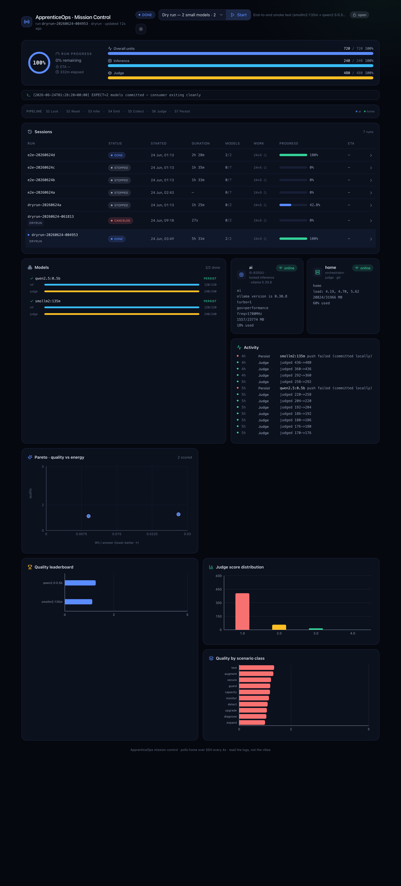

# ApprenticeOps · Mission Control



A **Vite + React** dashboard over the two-node experiment pipeline. It does not
compute anything itself: a thin **FastAPI** backend runs
[`scripts/pipeline-status.py`](../scripts/pipeline-status.py) on the `home` node
over SSH (home already mirrors the producer's results from `ai`) and serves that
JSON, plus a few control verbs. The React app polls `/api/status` every 4s and
renders the run progress, sessions, node health, per-model progress, and several
analysis charts. Light/dark themed, LAN-deployable, optional Authentik auth.

```
browser ──HTTP──▶ FastAPI (backend/app.py) ──ssh──▶ home ──python──▶ pipeline-status.py
                                                      └──ssh──▶ ai  (control + telemetry)
```

## Walkthrough

- **Header** — title, the active run id + state pill, the controls, an auth
  indicator (`open` / signed-in user), and the **light/dark toggle**.
- **Run progress (hero)** — a radial %, plus **Overall / Inference / Judge** bars
  that fill to 100% at completion, with **ETA** (`d h m`), elapsed, and units/min.
- **Pipeline strip** — the seven stages S1–S7 (lock → reset → infer → emit on
  `ai`; collect → judge → persist on `home`); the live stage glows. Deliberately
  compact — the bars are the hero.
- **Sessions** — every run with status, start time, duration, models done/total,
  the `24×5·2j` work shape (scenarios × reps × judges), a progress bar, and ETA.
  Click a row to inspect that run.
- **Models** — per-model inference + judge bars (with a filter for big rosters).
- **Nodes** — `home` and `ai` health (load, memory, disk; on `ai` also turbo,
  governor, live frequency, ollama version).
- **Pareto** — per-model mean judge quality vs Wh/answer.
- **Quality leaderboard** — top models by mean judge score.
- **Judge score distribution** — histogram of all judgments (1–5).
- **Quality by scenario class** — where the models do well / struggle.
- **Activity / Skips** — the pipeline ledger and any judge skips.

## Controls

- **Start** — pick a **batch** (`dryrun` = 2 small models, `full` = the roster)
  and launch `run-e2e.sh` on home, detached, on its own `experiment/<run>` branch.
  Batches come from [`data/batches.json`](../data/batches.json). **Only one run at
  a time** — Start is refused (HTTP 409) while a run is active; stop it first.
- **Pause / Resume** — `SIGSTOP` / `SIGCONT` freezes the schedulers + inference
  process with all state intact; Resume continues exactly where it stopped (the
  ollama server is separate, so an in-flight token stream stalls, but no rows are
  lost). The pipeline is also **scenario-level resumable** if the process is gone.
- **Stop** — *cancels* the run: kills both process trees and writes a `.canceled`
  marker. The run is terminal (shows `CANCELED`) and cannot be resumed — start a
  fresh run instead.

## Run it — LAN (Docker on the home node)

For an always-on, LAN-accessible instance, run the container on `home`:

```bash
cd dashboard
HOME_SSH=home AI_SSH=home-ai.hont.ro REPO_DIR=/home/dragos/apprenticeops \
  docker compose up -d --build      # → http://<home-lan-ip>:8770
```

The container publishes `0.0.0.0:8770` (LAN-reachable) and mounts `~/.ssh`
read-only. The mounted ssh config must define `Host home` (and `home` must reach
`home-ai.hont.ro` passwordlessly, which it already does). A `/healthz` endpoint
backs the compose healthcheck. Keep it on the trusted LAN.

## Authentication (feature toggle)

Auth is a single switch:

| `AUTH_ENABLED` | Behaviour |
| --- | --- |
| `false` (default) | **No auth** — open on the LAN. The header shows `open`. |
| `true` | Every request must carry the **Authentik** forward-auth header (`AUTH_HEADER`, default `X-authentik-username`). Requests without it get `401`. |

When enabled, put the dashboard behind the **Authentik** proxy/outpost (forward-
auth) so the proxy authenticates the user and injects the header; the app trusts
it and surfaces the signed-in user in the header. `/healthz` stays open for probes.

```bash
AUTH_ENABLED=true AUTH_HEADER=X-authentik-username docker compose up -d
```

## Run it — dev (on the Mac)

Two terminals. The backend SSHes to home via your `homelab` alias.

```bash
# 1) backend
cd dashboard/backend
python3 -m venv .venv && . .venv/bin/activate
pip install -r requirements.txt
HOME_SSH=homelab AI_SSH=home-ai.hont.ro REPO_DIR='~/apprenticeops' \
  python -m uvicorn app:app --reload --port 8770

# 2) frontend (proxies /api + /ws to :8770)
cd dashboard/frontend
npm install
npm run dev          # → http://127.0.0.1:5290
```

## Trust model

Single-operator tool for a trusted LAN. With `AUTH_ENABLED=false` there is **no
auth** — anyone who can reach it can drive the run; keep it on the LAN (or turn
on Authentik). Every privileged action shells into `home` over SSH; the client
may only choose a server-validated *batch id* and *run id*, and nothing it sends
is interpolated raw into a shell.
