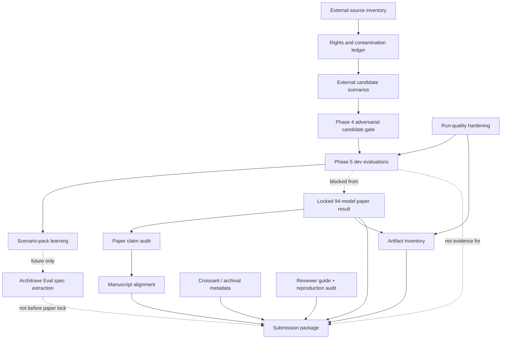

# Paper and Data Completion Plan

Status: working inventory, created 2026-07-03. This document is the control plane
for finishing the ApprenticeOps paper/data artifact without expanding the paper
scope. It incorporates the useful part of the 2026-07-03 ecosystem strategy:
**ApprenticeOps is the first scenario pack and proof point for deployment-centric
evaluation; it is not the whole platform.**

## Positioning Lock

ApprenticeOps should be presented as a benchmark and measurement artifact for
choosing small locally-sovereign **deployments**, not as a universal model
leaderboard. The object being evaluated is the deployed configuration:

```text
Deployment = Model + Runtime + Hardware + Quantization + Prompt + Memory + Strategy + Configuration + Evaluation Policy
```

The paper-era result remains narrower than that full future framework. It measures
off-the-shelf local Ollama deployments on one locked CPU node and a homelab ops
scenario pack. The future reusable framework can be called Architrave Eval / CEOps,
but the paper should not rename itself around that future work.

## Adopt / Defer from the Ecosystem Strategy

| Strategy idea | Decision for ApprenticeOps now |
|---|---|
| "Measure deployments, not models." | **Adopt** as contribution framing. The paper already has model, runtime, hardware, quantization, prompt, strategy, memory, and evaluation metadata; make that explicit. |
| Architrave as umbrella Engineering OS | **Reference lightly.** ApprenticeOps can say it is built with Architrave, but the paper should stand alone. |
| Architrave Eval / CEOps as extracted framework | **Defer to future work.** Create a spec extraction plan after paper lock; do not block submission on it. |
| ApprenticeOps as first scenario pack | **Adopt.** This sharpens novelty: first ops/homelab pack proving deployment-centric evaluation under local-sovereign constraints. |
| AletheiaBench and mobile/journaling packs | **Defer.** Mention only as generalization pressure, not as a paper deliverable. |
| Freeze reference apps | **Out of scope for this repo.** Useful portfolio decision, not ApprenticeOps paper work. |

## Current Evidence State

| Area | State | Evidence / artifact |
|---|---|---|
| Locked paper result | Consolidated 94-model result is the publishable paper basis. | `docs/PAPER_PHASES.md`, `data/snapshots/`, `data/site/`. |
| External candidate work | Dev-only follow-up, not paper scoring. | `docs/EXTERNAL_DATASET_INTEGRATION_PLAN.md`, `data/scenarios.external-candidates-v0.json`. |
| External candidate smoke | Dryrun launch/judge/persist path works, but one duplicate judge row makes it smoke-only. | `external-v0-dryrun-baseline-20260703-063154`. |
| External candidate pilot | Clean dev evaluation: 80/80 inference rows, 160/160 unique judge tuples. | `external-v0-strategy-pilot-2-baseline-20260703-081018`. |
| Scenario-level error review | Completed for strategy-pilot. | `docs/EXTERNAL_DATASET_PHASE5_ERROR_REVIEW.md`. |
| `spread10` on external candidates | Completed dev run. | `external-v0-spread10-baseline-20260703-091212`; review in `docs/EXTERNAL_DATASET_PHASE5_SPREAD10_REVIEW.md`. |
| CEOps metrics/source analysis | Completed first pass. | `docs/CEOPS_METRICS_SOURCE_ANALYSIS.md`. |

## Dependency Graph



Read this graph as a guardrail: **the locked 94-model paper result feeds the
paper; external candidate work feeds future scenario-pack learning.** External
dev evaluations may improve future ApprenticeOps/Architrave Eval design, but they
do not flow back into the paper claim unless a new version is explicitly locked.

## Experiment Readiness Verdict

| Candidate next action | Verdict | Reason |
|---|---|---|
| Start / continue paper submission writing from the 94-model result | **Yes** | Paper data is locked; remaining work is claim audit, artifact inventory, and submission packaging. |
| Run `spread10 × external-candidates-v0` as a dev evaluation | **Done** | Completed as a dev-only run with 400/400 inference rows and 800/800 unique judge tuples. |
| Promote `external-candidates-v0` to Core or paper scoring | **No** | Rights/provenance gate only allows candidate/dev use; no held-out near-duplicate gate or Core lock exists. |
| Start Architrave Eval schema extraction | **After paper claim audit** | Useful and strategically aligned, but it risks pulling the paper into platform work before submission readiness. |
| Start AletheiaBench | **No** | It is the right future pressure test, but only after a minimal spec boundary exists. |

The main gap in “starting the experiment already” was not infrastructure. The
runner works, the dev scenario set launches, and both `strategy-pilot-2` and
`spread10` completed cleanly. The next gap is **interpretability discipline**:
before any promotion or larger sweep, inspect the low-scoring scenarios and decide
whether to clarify, split, or keep them hard.

## Remaining Work Inventory

### A. Paper Claim and Positioning

| Task | Status | Gate |
|---|---|---|
| Make deployment-centric evaluation explicit in the paper intent and final manuscript. | in-progress | A reader can distinguish *deployment selection* from *model ranking*. |
| Keep ApprenticeOps scoped as a scenario pack / benchmark artifact. | in-progress | README, reviewer guide, and paper do not imply ApprenticeOps is the whole platform. |
| Preserve non-claims. | ongoing | No Core/paper claim uses external candidate results; no universal hardware/model ranking. |
| Align title/subtitle if needed. | not-started | Title still reads naturally and does not over-brand Architrave Eval / CEOps. |

### B. Data and Artifact Package

| Task | Status | Gate |
|---|---|---|
| Keep 94-model snapshots frozen for paper claims. | done/ongoing | Any new run is labelled dev/follow-up, not merged into paper snapshots. |
| Add Croissant / dataset metadata for Datasets & Benchmarks readiness. | not-started | Machine-readable metadata validates and points to immutable data artifacts. |
| Create artifact inventory: snapshots, site exports, notebooks, scripts, model metadata, licenses. | not-started | Reviewer can tell exactly which files reproduce each headline number. |
| Add judge-row duplicate reporting to `report-run-quality.py`. | done | Report prints duplicate judge tuples, not only inference duplicate tuples. |
| Decide whether to de-duplicate the dryrun judged file or leave as caveated smoke. | not-started | If used in any table, de-duplication is scripted and recorded. |

### C. Tests and Deterministic Gates

| Task | Status | Gate |
|---|---|---|
| Existing scenario gates. | passing | `python3 scripts/validate-scenarios.py`. |
| External candidate gates. | passing | `python3 scripts/validate-external-candidates.py`. |
| Run-quality gate for external dev runs. | passing | `report-run-quality.py` reports inference and judge duplicate tuples. |
| Add automated test for judge duplicate detection. | done | `scripts/test-report-run-quality.py` fails on a duplicated `(model, scenario, rep, memory, strategy, judge_model)` row. |
| `spread10` external dev run. | done | 400/400 inference rows, 800/800 unique judge tuples, DNF 0/400, zero-output stalls 0/400. |
| CEOps metrics/source analysis. | done | Metrics verdict and source-driven improvement backlog recorded in `docs/CEOPS_METRICS_SOURCE_ANALYSIS.md`. |
| Add a paper-data audit command. | not-started | One command re-runs all non-notebook structural checks before submission. |

### D. Documentation

| Task | Status | Gate |
|---|---|---|
| Paper design/analysis plan. | exists | `docs/PAPER.md`; should remain pre-registration/design source, not be rewritten as manuscript. |
| Manuscript/site. | exists | `docs/analysis/paper.qmd`; GitHub Pages workflow renders committed outputs. |
| Reviewer guide. | exists | `REVIEWER.md`; needs update only if contribution framing changes materially. |
| Reproduction guide. | exists | `REPRODUCE.md`; may need a short section on dev-only external candidate runs. |
| External dataset docs. | current | Phases 1-5 documented; Phase 6 blocked. |
| Glossary/spec extraction docs. | not-started | Future Architrave Eval work; do not block paper. |

### E. Deployment / Operations

| Task | Status | Gate |
|---|---|---|
| GitHub Pages analysis site. | configured | `.github/workflows/publish-analysis.yml` renders `docs/analysis`. |
| Mission-control dashboard. | useful for operations, not paper-critical | Live CEOps should show `external-candidates-v0` as dev-only via matrix description. |
| Clean homelab run checkouts. | working but ad hoc | Use clean SSH-remote checkouts for launched runs; avoid dirty experiment worktrees. |
| AI-node canonical sync. | partial | Dev runs may use `SYNC_MODE=working-tree`; canonical paper runs must use committed/pushed code and `SYNC_MODE=origin`. |
| Experiment branches. | working | External dev branches exist and are pushed; no need to merge into `main`. |

### F. Decisions Before More Data

| Decision | Required before |
|---|---|
| Is `spread10 × external-candidates-v0` worth the cost? | Done for this iteration. It produced useful dev signal and should not be repeated until scenarios are reviewed. |
| Should external candidates be revised based on strategy-pilot errors? | Any promotion beyond dev. First-pass error review completed; promotion still requires deeper review. |
| Should Architrave Eval schemas be extracted now or after submission? | Any `spec/*.schema.json` work. Recommended: after paper claim audit. |
| Should AletheiaBench be designed now? | Any non-ops scenario pack. Recommended: after spec skeleton, not before. |

## Recommended Next PRs in This Repo

1. **Paper contribution alignment.** Update `docs/analysis/paper.qmd`, `README.md`,
   and `REVIEWER.md` so the deployment-centric framing is consistent, without
   changing paper-era data or claims.
2. **Run-quality hardening.** Add `--strict` and `--markdown` modes to
  `scripts/report-run-quality.py` so dev-run reviews stop relying on bespoke
  snippets.
3. **Artifact inventory.** Add a concise data/release inventory for snapshots,
   site exports, notebooks, licenses, and model metadata.
4. **Adversarial go/no-go for `spread10`.** Decide whether breadth is worth the
   compute/judge cost after the clean `strategy-pilot-2` dev result.
5. **Spec extraction skeleton.** Start only after the paper claim audit is green.

## Quality Bar

The next paper/data change should be considered done only when:

- `python3 scripts/validate-scenarios.py` passes.
- `python3 scripts/validate-external-candidates.py` passes.
- Any run result cited in prose has a `report-run-quality.py` output and a judge
  duplicate check.
- Every new claim says whether it belongs to the **locked paper result**, the
  **external dev follow-up**, or **future Architrave Eval extraction**.
- No text implies Core promotion, judge calibration, training, or RAG from external
  data unless a later gate explicitly approves it.