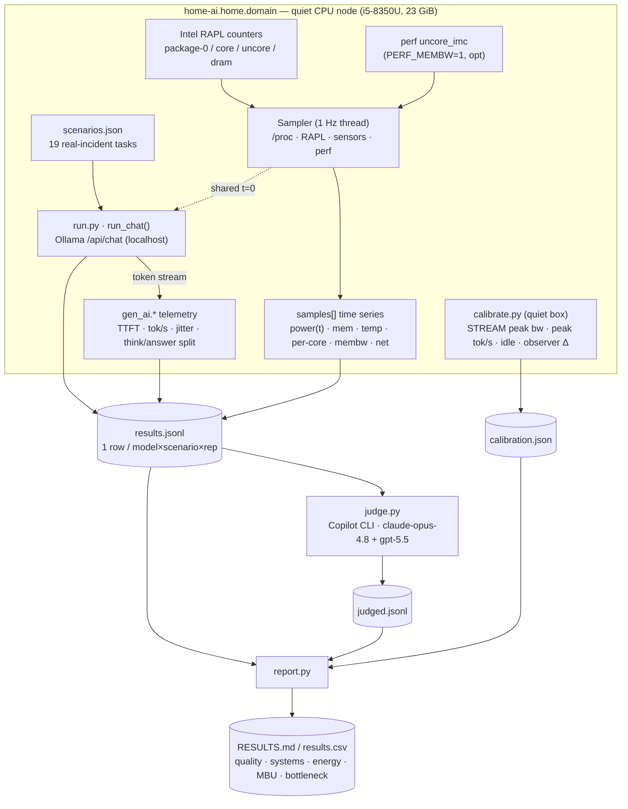

# TELEMETRY.md — ApprenticeOps data dictionary

Every evaluation run emits **one JSONL row per `(model, scenario, rep)`** to
`results.jsonl`, each carrying an aligned **1 Hz multivariate time series**
(`samples[]`) plus the per-request generation telemetry (OpenTelemetry
`gen_ai.*`-aligned). `calibrate.py` writes the hardware **ceilings** to
`calibration.json`; `report.py` joins the two into the derived systems metrics.

This file is the **contract** for that data: every field, its unit, and where it
comes from. It is what makes the released dataset reusable (PAPER.md §4b).

---

## How the data is produced

The system-under-test (`run_chat` → Ollama) talks **only to `localhost`**; the
`net_kb_s` series is the empirical proof of that (≈ 0 throughout inference). The
judge runs **off the node** and is the only deliberate egress (disclosed; PAPER
§6 "judge egress").

---

## 1. Per-row schema (`results.jsonl`)

### Identity & design factors
| Field | Type | Source | Meaning |
|---|---|---|---|
| `ts` | float (epoch s) | `run.py` | Row write time |
| `model` | str | models.txt | Ollama model tag under test |
| `bracket` | str | models.txt | Size bracket (`0-1B`…`4-5GB`) — the well-powered grouping |
| `env.memory_context` | str | run.py env | Run-level memory/context condition (`none`, `homelab-okf-v1`, …). This is an experimental comparison axis, not a scenario label. |
| `env.memory_context_file` | str\|null | run.py args | Markdown memory file injected into prompts for memory-conditioned runs; null for `none`. |
| `env.memory_context_sha` | str\|null | run.py | SHA256 of the injected memory file, so reruns can prove the memory bytes did not drift. |
| `env.inference_strategy` | str | run.py env | Run-level strategy condition (`baseline`, `best_of_3_detcheck`, …). This is an experimental comparison axis, not memory. |
| `env.strategy_prompt_file` | str\|null | run.py args | Optional strategy prompt file for prompt-only strategy variants. |
| `env.strategy_prompt_sha` | str\|null | run.py | SHA256 of the strategy prompt file. |
| `scenario` | str | scenarios.json | Scenario id (e.g. `detect-01`) |
| `class` | str | scenarios.json | Task taxonomy class (detect/diagnose/secure/…) |
| `aiopslab_task` | str | scenarios.json | AIOpsLab task mapping (provenance) |
| `grounding` | str | scenarios.json | `closed-book` (needs in-weights knowledge) or `grounded` (answer derivable from supplied context) |
| `difficulty` | str | scenarios.json | Author label `easy`/`medium`/`hard` → accuracy-by-difficulty |
| `pair_id` | str\|null | scenarios.json | Links paired RAG variants (same task, doc on/off) |
| `rep` | int | run.py | Repeat index (variance pass) |
| `seed` | int | run.py | Sampling seed (fixed per rep for reproducibility) |
| `temp` | float | run.py | Sampling temperature (0 = deterministic pass) |
| `think` | bool | run.py | Reasoning/think mode requested |

`memory_context` is deliberately separate from `grounding`. `grounding` describes
whether a scenario itself supplies reference material; `env.memory_context`
describes a run-wide briefing supplied before every scenario. A valid comparison
holds model set, scenario set, repeats, sampler, judge family, and node manifest
constant while changing only `env.memory_context`. In paper runs, "judge family"
means the full judge configuration: backend, model id, ensemble, and worker policy.

`env.inference_strategy` is separate again: it records *how* the local answer was
produced. Multi-candidate strategies stamp `strategy.*` fields and preserve
candidate sidecars so the selected answer is auditable. Reliability reports group
DNF/stall/length by strategy; strategy rows must not be averaged into baseline
rows unless the analysis explicitly facets by strategy.

Timeout-policy and stall-forensics fields (`effective.*`, `prompt.*`,
`stall_phase`, `http.*`, and compact `ollama.ps.*` snapshots) are evidence about
completion reliability. They are not quality scores; they make zero-output stalls
and timeout-policy changes visible instead of letting them hide inside averages.

### Quality
| Field | Type | Source | Meaning |
|---|---|---|---|
| `det_passed` / `det_total` | int | run.py checks | Deterministic checks passed / total |
| `det_score` | float 0–1 | run.py | `det_passed/det_total` — unambiguous-fact pass rate (no judge) |
| `det_detail` | list | run.py | Per-check `{type, pass, …}` (negation-aware excludes, `json_equals`, word-boundary tokens) |

### Generation telemetry (`gen_ai.*`, per request)
| Field | Unit | Source | Meaning |
|---|---|---|---|
| `gen_ai.usage.input_tokens` / `output_tokens` | tokens | Ollama | Prompt / completion token counts |
| `gen_ai.usage.output_chars` | chars | run.py | Completion character count → **tokenizer-independent** throughput (C2) |
| `gen_ai.completion` | str | run.py | **Verbatim model answer** — retained in the durable row so a run can be re-judged, shown as a transcript, or a judge verdict audited against the actual output |
| `gen_ai.thinking` | str \| null | run.py | Verbatim thinking-phase text (null when `--think` is off) |
| `gen_ai.thinking.chars` | chars | run.py | Chars emitted inside the think phase (split from the answer) |
| `gen_ai.server.time_to_first_token_s` | s | run.py | **TTFT** (prefill latency) |
| `phase.prefill_s` / `phase.decode_s` / `phase.think_s` | s | run.py | Phase durations (prefill / answer-decode / thinking) |
| `prefill_tok_s` / `decode_tok_s` | tok/s | run.py | Prefill / decode throughput |
| `decode.dt_p50_ms` / `dt_p95_ms` / `dt_max_ms` | ms | run.py | Inter-token latency **jitter** (stream smoothness) |
| `wall_s` | s | run.py | End-to-end wall time |
| `progress_trace` | list `[t, cum_chars]` | run.py | Token-arrival curve (behaviour-over-time), shared `t=0` with `samples[]` |
| `gen_ai.response.finish_reasons` | list | Ollama/run.py | Stop reason or `DNF:*` |
| `dnf` | bool | run.py | Did-not-finish (timeout / stall / oom / loop) |
| `warmup_s` / `warmup_err` | s / str | run.py | Cold-load time (model pull+load) and any warmup error |

### Ollama-native internals (from `/api/show`, `/api/ps`, and the response)
| Field | Source | Meaning |
|---|---|---|
| `ollama.parameter_count` | /api/show | **Exact** parameter count (e.g. 494032768) — real model size, not a bracket guess |
| `ollama.parameter_size` / `ollama.quantization` / `ollama.family` | /api/show | e.g. `494.03M` / `Q4_K_M` / `qwen2` |
| `ollama.context_length` / `ollama.block_count` / `ollama.embedding_length` | /api/show | Native context window, layer count, hidden size |
| `ollama.feed_forward_length` | /api/show | FFN width (n_ff) |
| `ollama.head_count` / `ollama.head_count_kv` | /api/show | Query vs KV heads (GQA ratio = KV-cache compression) |
| `ollama.expert_count` / `ollama.expert_used_count` / `ollama.expert_shared_count` | /api/show | **MoE: experts active/total per token** ("nodes activated"); None/0 = dense |
| `ollama.size_bytes` / `ollama.size_vram_bytes` | /api/ps | Loaded model size; **`size_vram = 0` is Ollama's own proof of CPU-only** |
| `ollama.cpu_pct` / `ollama.gpu_pct` | /api/ps | Processor split (100 / 0 on this node) |
| `ollama.load_duration_s` / `ollama.total_duration_s` | response | Native per-request model-load + end-to-end durations (authoritative) |

> The native `eval_count`/`eval_duration`/`prompt_eval_*` from the same response
> already back `gen_ai.usage.*` and `decode_tok_s` above — they are Ollama's
> ground-truth token counts and ns timings, not our wall-clock estimate.

> **MoE "nodes activated"**: `expert_used_count`/`expert_count` (e.g. `granite4:tiny-h`
> = 6/64) is the *static* sparsity — a MoE computes like its active-param size but
> needs the total footprint in RAM. *Which* experts fire per token (dynamic
> routing) is **not** exposed by Ollama/llama.cpp (PAPER §6). GGUF carries many
> more keys (rope base/scaling, ssm conv/state for Mamba hybrids like granite4,
> key/value head dims) — capturable on demand via the same `/api/show` path.

### Energy & thermal (per request)
| Field | Unit | Source | Meaning |
|---|---|---|---|
| `power.source` | str | run.py | `rapl:package-0` \| `plug:ha` \| `plug:dirigera` — which meter was used |
| `power.mean_watts` / `power.peak_watts` | W | RAPL/plug | Mean / peak power over the request |
| `power.energy_wh` | Wh | RAPL/plug | **Measured energy/task** (counter-delta joules ÷ 3600) |
| `power.idle_watts` | W | run.py | Idle baseline → **net-over-idle** |
| `power.peak_dram_w` | W | RAPL `dram` | Peak memory-controller power (bandwidth proxy) |
| `thermal.peak_c` | °C | sensors | Peak package temp (throttle signal) |
| `thermal.start_c` | °C | sensors | Temp **before** the task — thermal-carryover **covariate** (C1) |

### Memory, bandwidth & the time series
| Field | Unit | Source | Meaning |
|---|---|---|---|
| `peak_swap_mb` | MB | /proc | Peak swap used (capacity-bound signal) |
| `min_mem_avail_mb` | MB | /proc | Min available RAM during the request |
| `mem.peak_rss_mb` | MB | /proc | Peak model-runner resident set |
| `membw.peak_mb_s` | MB/s | perf | Peak achieved DRAM bandwidth (only if `PERF_MEMBW=1`) → **MBU** numerator |
| `membw.series` | list | perf | Bandwidth(t) samples |
| `membw.requests` | dict | perf | Memory-request split by requestor: `ia`=CPU, `gt`=iGPU, `io`=device — gt≈0 proves no GPU offload |
| `mem.rss_start_mb` / `mem.avail_start_mb` | MB | Sampler | First-sample RSS / avail RAM → growth & variation vs the peaks/min |
| `swap.start_mb` | MB | Sampler | First-sample swap → swap **delta** (in-pressure) vs `peak_swap_mb` |
| `gpu.peak_freq_mhz` | MHz | i915 | Peak iGPU GT clock over the task (~300 = idle = CPU-only) |
| `perf.core` | dict | perf | CPU microarch (PERF_CORE=1): instructions, cycles, **ipc**, cache_misses, llc_load_misses, branch_misses |
| `proc.minflt` / `proc.majflt` / `proc.ctxt_switches` | n | /proc | Per-request minor/major page-fault + context-switch **deltas** (first→last sample) |
| `samples` | list | Sampler | The 1 Hz multivariate series (next table) |

---

## 2. 1 Hz sample schema (`samples[]`)

Each element is one tick of the on-device profiler (default 1 Hz; `SAMPLE_INTERVAL`
configurable sub-second to avoid aliasing — M2). All share `t=0` with
`progress_trace`.

| Field | Unit | Source | Meaning |
|---|---|---|---|
| `t` | s | Sampler | Seconds since request start |
| `mem_avail_mb` / `swap_used_mb` | MB | /proc/meminfo | Available RAM / swap in use |
| `rss_mb` / `threads` / `majflt` / `minflt` | MB / n / faults | /proc/\<pid\> | Model-runner RSS, threads, major + minor page-faults |
| `ctxt_vol` / `ctxt_invol` | n | /proc/\<pid\> | Voluntary / involuntary context switches (scheduler pressure) |
| `watts` | W | smart plug | Wall power (if a plug is configured) |
| `rapl_watts` | W | RAPL | Package power this tick |
| `dram_w` / `core_w` / `uncore_w` | W | RAPL subdomains | Memory / cores / uncore power split (per-subdomain wrap-corrected — M1) |
| `cpu_temp_c` / `cpu_freq_mhz` / `cpu_util_pct` | °C / MHz / % | sensors, /proc | Aggregate thermal / clock / utilization |
| `gpu_freq_mhz` | MHz | i915 sysfs | iGPU GT actual clock; ~300 = idle floor (CPU-only evidence) |
| `core_util` / `core_freq` | list % / list MHz | /proc | **Per-core** utilization and frequency (parallelism + throttle detail) |
| `disk_mb_s` / `net_kb_s` | MB/s / kB/s | /proc | Disk and **network** I/O — `net_kb_s ≈ 0` is the egress invariant |
| `load1` | float | /proc/loadavg | 1-minute load average |

> **CPU frequency is sampled** (`cpu_freq_mhz` aggregate + `core_freq` per-core) —
> the clock(t) trace is the throttle/turbo evidence. **DRAM frequency is *not*
> sampled**: it is fixed by the DIMMs under load (it does not dynamically scale
> like the CPU), so it is a **static environment fact** (below). What varies for
> memory — and what we *do* sample — is **bandwidth** (`membw.peak_mb_s`) and
> **power** (`dram_w`).

> **iGPU & per-channel.** `gpu_freq_mhz` + the perf **requestor split** (`ia`/`gt`/`io`)
> capture whether the integrated GPU does any work (it doesn't — Ollama is
> CPU-only, `llama-server` with no `-ngl`). The asymmetric **dual-channel flex
> region** (first 16 GB interleaved ~38 GB/s, top ~8 GB single-channel ~19 GB/s)
> is **not** attributable per test: the IMC PMU counts by requestor, not by
> channel, and per-page channel mapping isn't OS-exposed. We capture the *effect*
> (achieved bandwidth / MBU), not a region label. See PAPER §4b for how this
> telemetry maps onto public hardware datasets (Backblaze SMART, Google Borg
> power, Alibaba AMTrace, MLPerf Power) and the `dataset.py` ML-ready export.

### Static environment facts (recorded once in ENVIRONMENT.md, not sampled)

| Fact | This node | Source |
|---|---|---|
| CPU | Intel i5-8350U, 4C/8T, base 1.70 GHz, turbo 3.60 GHz, AVX2 (no AVX-512), 15 W TDP | `lscpu` |
| DRAM | 24 GiB DDR4-**2400 MT/s**, dual-channel (ChannelA 8 GB Micron r1 + ChannelB 16 GB SK Hynix r2 → asymmetric/flex); theoretical peak ≈ **38.4 GB/s** | `dmidecode -t memory` |
| NVMe | WD PC SN730 256 GB, **PCIe 3.0 ×4** (8 GT/s ×4, ~3.4 GB/s rated read); root on LVM | `lsblk` / `lspci` |
| Swap | **zram0 11.6 GB** (compressed RAM, priority 100 — used first) **+ /swap.img 8 GB on NVMe** (overflow). So light swap = CPU compression cost; heavy swap spills to disk | `/proc/swaps` |
| Power policy (systems pass) | governor `performance`, **turbo off**, clock pinned to base (`no_turbo=1`, min=max=100 %); EPP `performance`; **Wi-Fi + Bluetooth disabled** (rfkill); no TLP/ppd/auto-cpufreq; on AC | `node-power.sh` |
| Stack | Ubuntu · Ollama 0.30.8 · Python 3.14 | `ollama --version` |

The **measured** STREAM peak (`calibrate.py`, §3) is what MBU divides by; it sits
**below** the 38.4 GB/s theoretical figure (achievable < theoretical), which is
exactly why MBU uses the measured value, not the datasheet.

---

## 6. Capture coverage & adversarial gap analysis

**Captured per task** (+ the aligned 1 Hz series of each): **quality** (det +
judge + criteria-met/missed), **latency** (TTFT, TPOT, jitter p50/p95/max),
**throughput** (tok/s, chars/s), **energy** (RAPL package + core/uncore/dram, Wh,
net-over-idle, J/token), **thermal** (peak/start temp, freq, throttle), **memory**
(RSS start→peak, swap, min-avail, major+minor faults), **bandwidth** (perf IMC +
requestor split ia/gt/io), **microarch** (IPC, cache/LLC/branch misses),
**scheduler** (context switches, load), **I/O** (disk, net≈0 egress proof),
**accelerator** (iGPU freq, `size_vram=0`), **architecture** (exact params, MoE
experts active/total, GQA heads, layers, ffn), and **provenance** (digest, quant,
seed, temp).

**Deliberately NOT captured, and why** (the honest gaps):

| Not captured | Why | Could add |
|---|---|---|
| Per-token MoE routing (which experts fire) | Ollama/llama.cpp don't expose `ffn_gate_inp` router logits | engine instrumentation |
| Dual/single-channel region per page | IMC PMU counts by requestor, not channel; per-page mapping not OS-exposed | pagemap + BIOS interleave map (approx) |
| Per-process (not system-wide) perf counters | `perf -a` is whole-socket; on the quiesced node Ollama is the only load | `perf stat -p <pid>` (loses uncore) |
| Token logprobs / output entropy | Ollama `/api/chat` doesn't return logprobs | a logprob-enabled backend |
| iGPU busy % (only freq) | `size_vram=0` + `gt_requests`≈0 already prove CPU-only | i915 `rcs0-busy` PMU (intel_gpu_top) |
| Wall power (only RAPL SoC) | the smart plug reads 0 W (defective); RAPL is modeled SoC energy | a working plug cross-check |

The systems axis is intentionally **over-instrumented** — several redundant
CPU-only proofs (`size_vram`, `gt_requests`, `gpu_freq`, net≈0) — so no single
broken signal silently invalidates a claim.

---

## 3. Calibration schema (`calibration.json`, from `calibrate.py`)

Run on a **quiet** node (no competing load) so the ceilings are real.

| Field | Unit | Meaning |
|---|---|---|
| `peak_membw_mb_s` | MB/s | STREAM-style multi-thread memcpy peak DRAM bandwidth → **MBU denominator** |
| `membw_stress_threads` | n | Threads used to saturate memory |
| `peak_tok_s` | tok/s | Tiniest model decode rate — a practical speed ceiling |
| `idle_watts` / `idle_temp_c` | W / °C | Idle baselines (net-over-idle, throttle reference) |
| `telemetry_overhead_pct` | % | tok/s lost to the sampler+perf — the **observer effect** (C3) |
| `rapl_domain` | str | RAPL domain used (e.g. `package-0`) |
| `perf_membw_enabled` | bool | Whether `PERF_MEMBW` was on during the probe |

---

## 4. Derived metrics (computed in `report.py`)

| Metric | Formula | Notes |
|---|---|---|
| **TPOT** (ms/token) | `1000 / decode_tok_s` | Inter-token latency; pairs with the jitter percentiles |
| **chars/s** | `output_chars / decode_s` | Tokenizer-independent throughput (C2) |
| **J/token** | `energy_wh × 3600 / output_tokens` | Energy per generated token |
| **Wh/correct** | `mean(energy_wh) / det_mean` | Energy per correct answer (accuracy-weighted) |
| **tok/s/W** | `median(decode_tok_s) / mean_watts` | Efficiency frontier |
| **MBU** | `mean(membw.peak_mb_s) / peak_membw_mb_s` | Model Bandwidth Utilization vs the **measured** peak (blank without calibration) |
| **bottleneck** | telemetry fingerprint | `capacity (swap)` if swap>threshold · `thermal` if peak≥`THROTTLE_C` or throttled · `bandwidth` if MBU≥0.45 · else `compute/latency` |
| **throttle** | `peak_temp_c ≥ THROTTLE_C` | Heuristic clock-pull-back flag (`THROTTLE_C` env, default 90 °C for the 15 W i5-8350U) |
| **paired RAG lift** | within-pair `grounded − closed-book` det | Isolates retrieval (vs the confounded whole-class means) |

---

## 5. Validity notes

The telemetry is rich but **modeled and host-specific**. Before drawing
cross-model systems conclusions, read PAPER.md §6 — in particular: RAPL is a
**modeled SoC estimate**, not wall power (M1); the sampler **perturbs** what it
measures, quantified by `telemetry_overhead_pct` (C3); tok/s is **not**
comparable across tokenizers, so use chars/s (C2); and the deterministic
*quality* axis is order-insensitive, but **systems** numbers require the
thermal-order controls (`--shuffle` + cooldown + `thermal.start_c`, C1). MBU is
only trustworthy against the **measured** STREAM peak, never the datasheet (M4).
