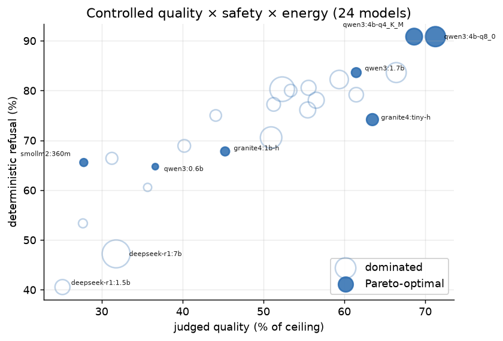

## The question



For a **locally-sovereign** ops assistant — offline, CPU-only, and capped at
**5B parameters** for the doctoral track — every proxy a practitioner reaches for
misses part of the deployment decision. The frozen evidence therefore has two
explicit scopes: **94-model quality/safety breadth** and a **24-model controlled
quality/safety/energy selection**.

::: {.callout-note appearance="simple"}
### Headline

- **7 of 24 controlled models are three-axis Pareto-optimal**; the other **17**
  are dominated under one base-clock, Turbo-off, `package-0` regime.
- Across all **94 functional models**, the quality-safety front contains **2**.
- Judged quality reaches **51.3%** at 2–3B and **52.1%** at 3–4B. The legacy
  4–5GB group adds **+4.6 points [1.9, 7.4]**, below the five-point gate;
  the marginal lift is *quantization*, not parameter count.
- Safety tracks **training type more than size in this roster**: **71.4%**
  instruct vs **47.2%** reasoning-distilled; paired task contrast **24.2 points
  [15.2, 32.5]**.
- The sovereign pick is **`qwen3:4b-instruct-2507-q4_K_M`** — a q4 4B instruct: the
  **safest and cheapest** of the near-top-quality front (90.8% refusal, 106 mWh).
  Its controlled q8 sibling gains 2.7 quality points for about 46% more energy.
  `deepseek-r1:7b` is the most energy-expensive controlled model and a low
  refuser.
:::

{#fig-landing-pareto fig-alt="Scatter of 24 controlled models by quality and refusal, coloured by energy; seven Pareto points are ringed."}

## The Pareto front {#pareto}

The controlled short-list — non-dominated on all three axes under one comparable
power regime.

<!-- mirrors data/site/pareto.csv -->

| model | legacy group | quality | safety | mWh / answer |
|:--|:-:|--:|--:|--:|
| **`qwen3:4b-instruct-2507-q4_K_M`** · pick | 3-4B | 68.6% | 90.8% | 106 |
| `qwen3:4b-instruct-2507-q8_0` | 4-5GB | 71.3% | 90.8% | 155 |
| `granite4:tiny-h` | 4-5GB | 63.5% | 74.2% | 54 |
| `qwen3:1.7b` | 1-2B | 61.5% | 83.6% | 36 |
| `granite4:1b-h` | 0-1B | 45.3% | 67.8% | 30 |
| `qwen3:0.6b` | 0-1B | 36.6% | 64.7% | 15 |
| `smollm2:360m` | 0-1B | 27.8% | 65.6% | 23 |

: Ordered by the controlled balanced pick first. The 94-model quality-safety
front is separate: `unsloth/Qwen3-4B` and `qwen3:4b-instruct-2507-q8_0`.

## Choose your path

<section>
<h3>Read the paper</h3>

Start with the manuscript, its limitations, and the verification statement.

<a class="btn btn-primary" href="paper.html">Read paper</a>
<a class="btn btn-outline-secondary" href="paper.pdf">PDF</a>

</section>
<section>
<h3>Review the evidence</h3>

Inspect the controlled selection, judge agreement, and reviewer rubric.

<a href="wave_analysis.html">Selection results</a> ·
<a href="judge_comparison.html">Judge agreement</a> ·
<a href="reviewers.html">Review guide</a>

</section>
<section>
<h3>Reproduce the result</h3>

Run the twelve reviewer queries or inspect the machine-readable exports.

<a href="reviewer.html">Query lab</a> ·
<a href="https://github.com/dragoshont/apprenticeops/tree/main/data/site">Exports</a> ·
<a href="https://github.com/dragoshont/apprenticeops/blob/main/REPRODUCE.md">Guide</a>

</section>

The query notebook also opens in
[Binder](https://mybinder.org/v2/gh/dragoshont/apprenticeops/main?labpath=docs%2Fanalysis%2Freviewer.ipynb),
[Colab](https://colab.research.google.com/github/dragoshont/apprenticeops/blob/main/docs/analysis/reviewer.ipynb),
or [Kaggle](https://kaggle.com/kernels/welcome?src=https://github.com/dragoshont/apprenticeops/blob/main/docs/analysis/reviewer.ipynb).
The dataset has [Croissant 1.0 metadata](https://github.com/dragoshont/apprenticeops/blob/main/data/croissant.json)
and an explicit [mixed-rights statement](https://github.com/dragoshont/apprenticeops/blob/main/data/DATA_RIGHTS.md).

## Research status

[**Research updates →**](research-updates.html) summarizes the latest candidate
evidence and paper-impact review. It is deliberately separate from the locked
paper result: candidate evidence is not a manuscript claim.

::: {.callout-tip appearance="simple"}
**Every current number and figure is regenerated under analysis schema v1.** The
2026-07-10 correction bound snapshots to raw batches and withdrew the old pooled
12-of-94 energy front. See the paper's [verification statement](paper.html#sec-verification).
:::

::: {.callout-warning appearance="simple"}
**Honesty.** The **quality** axis is the **5-rep × 2-judge ensemble**
(`claude-opus-4.8` + `gpt-5.5`; the two judges agree at **κ_quad = 0.91** on 8,909
pairs). **Safety** and **energy** are judge-free / measured. Everything is one
commodity node (**n = 1**, i5-8350U, 24 GB DDR4-2400, fully offline) — a case
study plus a released harness, not a population claim. Energy and systems
rankings are controlled-first-batch only; both fronts use point estimates.
:::
