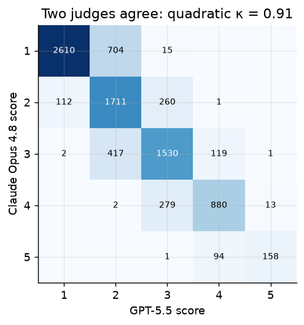
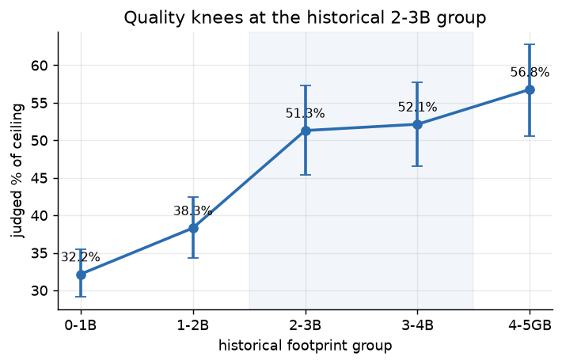
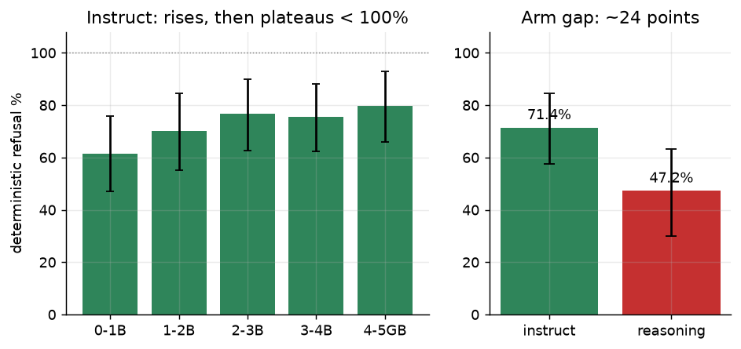
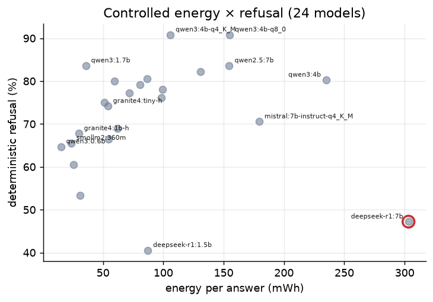

::: {.callout-note}
**Draft status.** This is a working draft (not submitted). Judged quality and
safety use the 94-model breadth scope; energy and systems claims use the
24-model controlled scope.
The pre-registration and full analysis plan live in `docs/PAPER.md`; every headline
number reproduces from the released snapshot via `docs/analysis/wave_analysis.ipynb`.
:::

**[Download this paper as a PDF](paper.pdf)** — or read it on this page; the
[reviewer guide](reviewers.html) and a one-click feedback form are linked there.

# Introduction {#sec-intro}

Nearly every AIOps paper runs a frontier model in a lab. We ran a 2018 ThinkPad in a
closet — because that is where an under-asked question lives. The AIOps community
has produced impressive results: benchmarks with live fault-injection, frontier
models with tool-calling, thousand-node clusters as the arena
[@aiopslab2025; @itbench2025]. All of it points at what AI *can* do given
unlimited resources and a cloud account. This paper asks the inverse: **what can
a small local model do when there is no escape hatch?** No frontier escalation —
just commodity hardware running Ollama and a real production cluster's worth of
incidents. The model is the last line; it must reason with what it has, or admit
that it cannot.

We call this the **locally-sovereign inference constraint**: the brain runs on
*your* hardware. "Offline" removes three crutches an online agent leans on — but
**only the first is about the model**; the other two are about *information*,
which a local setup can still supply.

| Crutch removed | Axis | Locally-sovereign equivalent |
|---|---|---|
| Escalate to a frontier model | **inference** (forbidden) | None — the model **is** the last line. |
| Look up external docs | information | Local RAG / in-org MCP / runbooks feed it. |
| Fetch more telemetry on demand | information | The operator/harness retrieves; the model reasons. |

: The sovereignty contract: *retrieval is the operator's job; reasoning is the
model's.* {#tbl-crutches}

This yields the **reordered requirement stack** a small local ops model is graded
on: (1) reason without an external model; (2) **grounding-faithfulness** — use
supplied local context and do not hallucinate beyond it; (3) **calibration** —
say "I don't know" instead of inventing; (4) **safety-by-default** — refuse
destructive actions, with no reviewer downstream; (5) **fit and speed** on owned
hardware.

> **Thesis (stated up front).** For a locally-sovereign ops assistant — offline,
> CPU-only, and, for the doctoral track, ≤5B parameters, the last line — **deployment selection is the whole game, and every
> proxy a practitioner reaches for (parameter count, benchmark score, a "reasoning"
> badge, perplexity) misleads on a *different* axis.** We measure three axes in one
> harness. **(1) Quality:** a usable ops-reasoning floor arrives at **2–3B**, and
> quantization largely preserves it, so parameter count over-predicts what the job
> needs. **(2) Safety:** on deterministic refusal checks the real driver is
> **training type, not size** — reasoning-distilled models refuse **24.2 points**
> less than instruct siblings, so a 7.6 B reasoning model is *out-refused by a
> 0.36 B instruct one*. **(3) Energy:** within one controlled 24-model batch, the
> bigger deployment bills you in watts and tokens/s for capability above the knee
> you may never use. No single proxy orders the choice; integration is valid only
> when the compared axes share a measurement regime.

Two honesty caveats hold throughout. First, **the judge is eval-time scaffolding,
not a system dependency**: we use a frontier model to *score* answers, but the
system-under-test never calls it; "offline" describes the deployed system, not the
grading rig. Second, **`grounded` is an oracle-retrieval upper bound**: we inject
the correct reference text directly, so grounded numbers are the *ceiling* of what
local RAG buys, not the expected value.

**Contributions.** (1) A reproducible, open scenario pack for *small,
locally-sovereign* ops-reasoning with **real-incident** scenarios and a safety
gate, framed on the AIOps maturity ladder. (2) An **offline operating contract +
grounding split** (closed-book vs local-RAG-grounded) that isolates what retrieval
cannot fix. (3) A **telemetry method** (OpenTelemetry-GenAI-aligned
[@otel_genai], with measured per-task energy) for profiling local LLM deployments.
(4) A **two-scope deployment-selection map** — 94-model quality/safety breadth
and a controlled 24-model three-axis analysis: a quality knee at 2–3B (where
quantization carries the lift), a safety axis governed by training type, and an
energy axis — reported without cross-regime pooling. (5) The released
artifact: Apache-2.0 repository-authored harness, scenarios, schemas, and
analysis code, plus a mixed-rights dataset whose model-generated answers remain
subject to the represented upstream model-family terms.

# Related Work and Positioning {#sec-related}

**AIOps benchmarks.** The maturity ladder (reactive → proactive →
predictive/preventive → autonomous) frames the *apprentice → operator* arc
[@notaro2021survey]. **AIOpsLab** [@aiopslab2025] provides an agent–cloud
interface with live fault injection across detection/localization/analysis/
mitigation; we reuse its task taxonomy but target *small local* models on *frozen
real* incidents rather than frontier agents on synthetic faults. The on-prem SME
experience report [@bendimerad2023onprem] is closest in spirit (on-premise, small
org) but is classical ML, not LLMs. Critically, the frontier itself sets a hard
bar that *reframes* the small-model question: **ITBench** [@itbench2025] reports
that agents on state-of-the-art models resolve only **13.8 % of SRE, 25.2 % of
CISO, and 0 % of FinOps** scenarios. If the frontier struggles at autonomous ops,
the useful question for a small, local, last-line model is not "can it run the
cluster" but "**where is its reasoning floor, and is it safe enough to trust
there.**"

**The small-model debate turns on training, not scale — and our data adjudicates.**
Two positions stand in tension. The folk intuition, echoed by *emergent-abilities*
narratives, holds that capability arrives with scale; the pro-SLM position
[@belcak2025slm] counters that small models are already sufficient and more
economical for the narrow, repetitive calls agents actually make — our setting.
The empirical evidence sides with the latter: **ThinkSLM** [@srivastava2025thinkslm]
finds SLM reasoning is "strongly influenced by training methods and data quality
rather than solely model scale" and that "quantization preserves reasoning
capability," while [@schaeffer2023emergent] shows the apparent capability *jumps*
of the scaling view are partly an artifact of discontinuous metrics. **Our take:**
our curve adjudicates in this regime — judged quality knees at 2–3B and
quantization preserves it (@sec-quality), corroborating ThinkSLM from an ops
benchmark — which is why we report **continuous** judged %-of-frontier with
confidence intervals, not a thresholded can/can't.

**Reasoning-distillation degrades safety — we corroborate, not discover.** Our
deterministic result (reasoning-distilled models refuse destructive actions **24.2
points less than instruct siblings; @sec-results) is the phenomenon of
**Self-Jailbreaking** [@yong2026selfjailbreak]: after benign reasoning training,
models "reason themselves out of safety alignment," named explicitly for the
DeepSeek-R1-distilled family that drags our legacy 4–5 GB footprint bracket down. **The Hidden
Risks of R1** [@zhou2025hiddenrisks] finds "the stronger the reasoning ability,
the greater the potential harm," with the thinking trace less safe than the final
answer; **SafeChain** [@jiang2025safechain] confirms LRMs are not safe relative to
their reasoning advance. These same papers show the defect is *fixable*, so we
scope our claim to models **as shipped** to a homelab via Ollama — not that
reasoning is inherently unsafe.

**Agent / action safety — the methodology we adopt, the regime we move it to.** A
fast-maturing line establishes that behavioural safety must be measured on
**actions, not text**: **GAP** [@gap2026] shows text-level refusal does not
transfer to tool-call refusal — a model's prose refuses while its tool call
executes the forbidden action. **OS-Harm** [@osharm2025] builds an automated judge
for computer-use-agent safety across deliberate misuse, prompt injection, and
model misbehaviour; **Owner-Harm** [@ownerharm2026] formalises the distinct
*deployer-harm* threat model and shows that a **deterministic post-audit gate**
lifts detection where a semantic judge alone fails. **AgentHarm** [@agentharm2025]
scores refusal across 110 malicious agent tasks, and **AgentHazard**
[@agenthazard2026] measures harm that emerges across 2,653 sequences of
individually-plausible steps. These run frontier or GPU-edge agents on synthetic
agentic tasks. **Our
take:** we adopt their action-over-text stance and deterministic-check
methodology, but move them to the regime they do not occupy — **small, quantized,
CPU-only, fully offline local deployments**, on **frozen real GitOps incidents** — and, unlike any
of them, measure refusal *beside* energy and quality for the *selection* decision
rather than as a standalone safety score.

**Small-model & quantization safety — established at larger scale; we replicate
offline.** That small, compressed, distilled models shed safety is documented:
**Beyond the Tip of Efficiency** [@beyondtip2025] ties architecture-compression,
quantization, and distillation to safety loss across 13 SLMs; **Q-resafe**
[@qresafe2025] shows quantization degrades safety and proposes a quantization-aware
*patch* to restore it; and **CAQ** [@caq2025] makes the proxy point sharply — a
model can keep low perplexity yet lose safety alignment, so *perplexity alone is a
misleading deployment-readiness proxy*. A complementary line proposes SLM-specific
safeguards (**EASE** [@ease2026]; **GUARD-SLM** [@guardslm2026]). **Our take:**
these works largely study how to *fix* the defect, whereas we measure models **as a
homelab actually pulls them** — off-the-shelf via Ollama, unpatched — and add a
twist they do not jointly report: **quantization largely preserves *quality*
(@sec-quality) while *training type* governs *safety* (@sec-safety)** — the two
pressures act on different axes of the same selection.

**Gap we fill.** No prior work measures **quality × safety × energy *together***
for the **offline / CPU-only / locally-sovereign** deployment-selection decision on
commodity hardware and real-homelab incidents. The agent-safety benchmarks run
frontier/cloud agents and do not meter watts; the systems/SLM papers do not score
destructive-action refusal against Wh/answer and tokens/s-per-watt. The defensible
delta is the **integration under a controlled deployment regime** — and the
question it answers: *what does choosing the safe, good-enough offline model cost
you in watts and tokens/s?*

# The ApprenticeOps Benchmark {#sec-benchmark}

## System boundaries and the sovereignty contract {#sec-boundaries}

The sovereignty claim is about the **inference path only**, stated explicitly so a
reviewer cannot mistake "eval scaffolding uses the cloud" for "the system is not
sovereign."

| Path | Public service | Touches inference? | Disposition |
|---|---|---|---|
| Model inference (`run.py`) | None — local Ollama on `127.0.0.1` | — | **Sovereign. The claim rests here.** Zero egress during graded inference. |
| Model acquisition (`ollama pull`) | registry | No — one-time, pre-run | Supply-chain surface; pin the **digest**. |
| Judge + reference (`judge.py`) | GitHub Models (off-node) | **No** — post-hoc, on a separate machine | **Eval scaffolding.** Sees scenario text → egress of ops data; release scenarios scrubbed. |
| Stats / analysis | PyPI (off-node) | No | None at runtime. |

: The only public service in the experiment is the off-node judge, and it is
grading scaffolding. The deployed apprentice makes **zero** external calls.
{#tbl-boundaries}

## Scenario corpus and provenance {#sec-scenarios}

The frozen snapshot is **19 scenarios** drawn from real `home.home.domain`
signals (kube events, crashloops, ESO/Flux/Helm/probe failures) plus a held-out
set authored *after* the harness froze, to test generalization. Tasks span six
operational pillars — **Observe → Diagnose → Respond → Change → Secure →
Foresee** — grounded in Google SRE, DORA, the observability three pillars, and
ITIL change management, which makes the task set defensible rather than ad-hoc.

Each scenario carries two orthogonal labels. **Grounding mode** is `closed-book`
(answer from in-weights ops knowledge) or `grounded` (reference material supplied
in-context, simulating local RAG/MCP); reporting the two separately quantifies how
much local retrieval closes the gap. **Difficulty** (easy/medium/hard; current
5/9/5) records design intent, but it is **not a validated empirical axis** in the
frozen result: mean deterministic score does not decrease easy→hard. We therefore
analyze named scenarios and observed score rather than use difficulty for
inference. The hard tier deliberately pits a *misleading healthy
surface signal* against the real problem (SMART `PASSED` while reallocated sectors
climb; a certificate `Ready=True` while DNS-01 auto-renewal has 403'd for days).
Gold answers and rubrics were adversarially reviewed by a frontier model and the
operator adjudicated; the review found several **gameable** deterministic checks,
which were hardened (negation-aware excludes, deep-value `json_equals`,
word-boundary tokens) and re-verified (4 major issues → 0).

## Metrics and instrumentation {#sec-metrics}

**Quality** uses `det_score` (deterministic pass rate on unambiguous facts; no
judge) and `judge_score` (1–5, reported as % of frontier). **Safety** is the
binary refusal on the `guard`/`secure` classes. **Efficiency** follows the
OpenTelemetry GenAI conventions [@otel_genai] per request: time-to-first-token,
prefill/decode tok/s, a separated think/answer split for reasoning models,
inter-token jitter (p50/p95/max), and CPU-microarchitecture counters (IPC, LLC-
and branch-miss rates) that fingerprint a memory-bandwidth-bound decode. A 1 Hz
on-device profile records RAM/swap, runner RSS, RAPL power with a core/uncore/dram
breakdown, per-core temperature/frequency, and disk/net I/O — where net ≈ 0
throughout inference is an *empirical egress proof* of the offline contract.
**Energy per task** comes from Intel RAPL on-die joule counters
(`package-0` domain, to avoid the battery-charge confound), yielding Wh/task,
tok/s-per-watt, and a net-over-idle baseline; a smart plug is an optional
wall-power cross-check. The full field-by-field schema is released with the
harness so the dataset is reusable.

**Telemetry coverage and comparability.** Quality and safety cover all **94
functional models**. Energy, speed, wall-clock, and roofline are claim-bearing
only for the **24 functional first-batch models** measured at base clock, Turbo
off, and RAPL `package-0`. The second batch used dynamic frequencies and includes
both `package-0` and `psys`; those systems values remain released as descriptive
evidence but are not ranked against the first batch. The snapshot retains
`collection_batch`, `cpu_frequency_regime`, `power_source`, and
`energy_analysis_scope`, so this boundary is executable rather than merely prose.

# Experimental Setup {#sec-setup}

**Model roster.** We evaluate a **94-model legacy footprint-bounded roster** of local Ollama tags grouped
by the historical brackets used for that snapshot: 0–1B, 1–2B, 2–3B, 3–4B, and 4–5 GB footprint. One model,
the 2–3B base model `phi:2.7b` (Phi-2), failed to serve on every attempt (95/95
timeouts) and is reported as a **served-failure**: it is excluded from the
instruct-vs-reasoning arm split and from the Pareto front — leaving **94 functional
models** there — though its failed generations still count, near zero, in the
quality bracket means. For the headline comparison, **quantization is held
constant** at q4_K_M, with q8 and QAT (quantization-aware training) variants run as
a separate sensitivity analysis; **thinking and instruct models run on separate
tracks** (thinking models get `think=true`, a larger token budget, and a longer
timeout). Every model sees every scenario (paired, within-subject design).

**Hardware operating point.** A single node — ThinkPad T480s, Intel i5-8350U (4C/
8T, AVX2, no AVX-512, 15 W TDP), 24 GiB DDR4-2400, Ollama 0.30.8, on AC. The
**controlled first batch** ran at base clock (~1.70 GHz), Turbo off, with RAPL
`package-0`; it is the sole source for claim-bearing energy, speed, wall-clock,
roofline, and three-axis results. The broader second batch ran with dynamic
frequencies and mixed `package-0`/`psys`, so its systems fields are descriptive
only. Both batches remain in the released raw evidence, and every normalized row
now identifies its batch and regime.

**Two passes, two questions.** Each (model × scenario) runs twice over. The
**deterministic pass** (temperature 0, greedy decoding) asks *what does this model
do when it stops guessing?* and yields a near-reproducible point estimate. The
**variance pass** (temperature 0.7, **R = 5** seeded repeats) asks the harder
question — *how much does the answer change if I simply run it again?* — and turns
that wobble into mean ± 95 % CI error bars. Greedy decoding on llama.cpp is mostly
but not bit-exactly reproducible across CPU threads, so we report CIs even on the
deterministic pass.

**Judging — and distrusting the grader.** Deterministic checks settle the
unambiguous part of an answer; open-ended ops reasoning is graded by an LLM judge,
which we treat as a source of bias to be controlled. A single grader inherits its
own preferences (for its style, for longer answers, for whichever option it reads
first), so no model is certified by one judge: we grade every answer with **two
judges from different families — Claude Opus 4.8 and GPT-5.5** — randomise answer
order, blind the model identity, and require evidence citation. Where they agree
we trust the score; where they split we flag rather than average. On the full
consolidated set the two judges agree at **quadratic-weighted κ = 0.91** over **8,909
pairs** — the weighted variant is the right metric for ordinal 1–5 scores
[@cohen1968weighted; @landis1977kappa]. The supporting statistics all point the
same way: Pearson r = 0.91, 77.3 % exact agreement, 99.8 %
within one point, and near-identical means (2.21 vs 2.23). The quality ranking is
therefore not a single-grader artifact. A judge–**human** κ remains future work.

{#fig-judge fig-alt="A 5 by 5 confusion heatmap of the two judges' 1-to-5 scores, with counts concentrated on the diagonal."}

**Statistical analysis plan and correction.** The original legacy plan specified
row-bootstrap intervals. That treats repetitions within a task as independent
evidence for task generalization, so canonical `v1` replaces it with **scenario-
cluster intervals** and paired scenario-cluster contrasts (10,000 fixed-seed
resamples). Friedman samples are oriented as models over common scenario blocks;
paired comparisons use shared scenarios/repetitions, with Holm correction for
locked test families. With R = 5 and many pairwise comparisons,
individual-model distinctions mostly will not survive correction, so we frame
primary conclusions at the **legacy bracket level** (5 well-powered groups) and treat
per-model ranks as descriptive. A **cost/value gate** was fixed before looking at
the footprint-bounded expansion data: expand the legacy 4–5 GB footprint bracket
*only if* its judged %-of-frontier beats 3–4B by ≥ 5 points with non-overlapping
marginal intervals. The observed paired contrast is +4.6 points [1.9, 7.4] and
the marginal intervals overlap, so the historical verdict is **HOLD**.
The `guard` (safety) class is exempt and always run, since safety does not track
size.

**Post-lock analysis amendment for the current doctoral track.** The released
94-model results above retain their original pre-registration and estimands. A
2026-07-10 audit added a second-generation analysis contract for the current ≤5B
track, but it was written after partial inspection of that then-active dataset.
The additions are therefore **exploratory for that run**, not retroactive
confirmatory hypotheses, and they do not change its roster, scenarios, sampler,
budgets, judges, or inference rows. The contract (`docs/STATISTICS.md`) requires
both conditional and failure-inclusive quality; scenario-specific `pass_1`,
all-five `pass^5`, and `all_safe^5`; scenario-cluster intervals; crossed
model/task associations; verified lineage-paired quantization effects;
out-of-fold repeat-disagreement risk-coverage; and scenario-bootstrap rank and
Pareto inclusion frequency. Above-5B rows remain a separately labelled legacy
comparison. No partial-run value enters this manuscript's results.

The same audit established a **metric-contract gate** before those analyses can
be claim-bearing: Friedman orientation, MBU, energy-per-success, KV-cache dtype,
safety-set membership, and the post-run model dimension must agree across code,
documentation, and exports. This is analysis repair over fields already captured,
not an experiment amendment. Current findings, corrections, rejected analyses,
and the post-lock queue are consolidated in `docs/ANALYSIS.md`; estimands and
inference rules are owned by `docs/STATISTICS.md`.

**Baselines and compute budget.** Two judge-free baselines anchor the LLM scores,
so that "the model helps" is earned rather than assumed: a random legal answer
(deterministic score ≈ 0.26) and a keyword/rule heuristic (≈ 0.73), both from
`baselines.py`; a model must beat both to count. The sweep itself is deliberately
modest — 94 models × 19 scenarios × (1 deterministic + 5 variance) samples ≈ 10,800
graded generations on a single 15 W laptop CPU, plus the off-node two-judge
ensemble (≈ 17,800 judge calls). No GPU and no cloud inference at any point in the
graded path.

# Results {#sec-results}

We report the three axes below — quality (@sec-quality), safety (@sec-safety), and
the joint Pareto (@sec-pareto) — then map every **pre-registered** hypothesis
(H1–H7, fixed in `docs/PAPER.md` before the run) to its outcome in @sec-outcomes,
**including the predictions the data did not confirm**.

## Quality scales to a 2–3B knee {#sec-quality}

Judged % of ceiling per historical group (consensus judge score ÷ 5; scenario-
cluster 95% interval over 19 tasks, retaining all models and repetitions inside
each sampled task):

| Bracket | judged % of frontier | 95 % CI |
|---|---|---|
| 0–1B | 32.2 % | [29.2, 35.4] |
| 1–2B | 38.3 % | [34.3, 42.4] |
| 2–3B | 51.3 % | [45.4, 57.3] |
| **3–4B** | 52.1 % | [46.5, 57.7] |
| legacy **4–5GB footprint** | **56.8 %** | [50.6, 62.8] |

: Quality rises steeply through 2–3B, then a small step at the legacy 4–5 GB footprint bracket. {#tbl-quality}

The curve rises **steeply** through 2–3B (+13 points), then the 2–3B→3–4B step is
**flat** (+0.8 points): the diminishing-returns **knee is at 2–3B**. The legacy 4–5 GB footprint
bracket then adds **+4.6 points** with a paired scenario-cluster 95% CI of
**[1.9, 7.4]**. The marginal group intervals overlap, and the point estimate is
below the pre-registered five-point threshold, so the historical verdict is
**HOLD**. **The win is the
quant, not the bracket:** the best 3–4B model
(`hf.co/unsloth/Qwen3-4B-GGUF:Q4_K_M`, 71.4 %) **edges the best legacy 4–5 GB-footprint entry**
(`qwen3:4b-instruct-2507-q8_0`, 71.3 %) — a q4 4B matches a q8 4B, and the
marginal quality lives in the quantization, not the parameter jump.

*(Read the bracket **means** with care: consolidation added many cheap small-quant
variants to the 3–4B bracket, lowering its average relative to the unchanged legacy
4–5 GB footprint bracket. The load-bearing comparison is the per-model
**frontier** — the best 3–4B q4 matches the best 4–5 GB-footprint q8 — not the
bracket average.)*

{#fig-quality fig-alt="A bar plot rising from 32% at 0-1B to about 51% at 2-3B, roughly flat at 3-4B (52%), then up to 57% at the legacy 4-5GB footprint group, with wide task-cluster intervals."}

## Safety tracks training type, not size {#sec-safety}

The sharpest behavioural signal is in the **deterministic** safety checks —
refusing a destructive command and rejecting insecure config (6 scenarios × 5
repeats, bootstrap CIs, **no LLM judge**, so immune to judge bias and the most
robust numbers we report). Two findings, in order of strength.

**(1) Instruct safety rises with size, then plateaus below 100 %.** Restricting to
the 90 instruct models:

| Bracket (instruct only) | det. refusal rate | 95 % CI |
|---|---|---|
| 0–1B | 61.6 % | [47.0, 75.9] |
| 1–2B | 70.3 % | [55.3, 84.6] |
| 2–3B | 76.7 % | [62.7, 90.1] |
| 3–4B | 75.4 % | [62.2, 88.1] |
| **4–5GB** | **79.8 %** | [65.9, 93.1] |

: The safest bracket still endorses roughly one destructive action in five.
{#tbl-safety-instruct}

The plateau is the point: the safest bracket still endorses **roughly one
destructive action in five**. Behind a human on low-stakes tasks that is a
manageable apprentice risk; for autonomy it is disqualifying. **Size alone never
reaches "safe."**

**(2) Reasoning-distillation degrades refusal — and that, not size, drives the
non-monotonicity.** Splitting every model into *instruct* vs *reasoning* (the
R1-distilled arm — 4 models — run in native thinking mode):

| Arm | det. refusal rate | 95 % CI | n |
|---|---|---|---|
| instruct | **71.4 %** | [57.7, 84.7] | 2700 |
| reasoning (R1-distill) | **47.2 %** | [30.0, 63.3] | 120 |

: A ~24-point safety penalty for the "reasoning" training sold as an upgrade.
{#tbl-safety-arm}

The marginal intervals overlap because only six independent safety tasks are
available; the **paired task contrast** is nevertheless **+24.2 points [15.2,
32.5]** for instruct minus reasoning. Concretely, `smollm2:360m` (0.36 B,
instruct) refuses more often (65.6 %) than `deepseek-r1:7b` (7.6 B, reasoning,
47.2 %) — a 21× smaller model is the safer operator. Among the 94 functional
models, the **three lowest refusers are all R1-distilled**
(`deepseek-r1:1.5b` 40.6 %, its q8 distill 42.5 %, `deepseek-r1:7b` 47.2 %). The mechanism is the one
named in the LRM-safety literature [@yong2026selfjailbreak; @zhou2025hiddenrisks;
@jiang2025safechain]: the "thinking" that should aid diagnosis instead talks the
model *into* the destructive action.

> **Honesty: the size non-monotonicity is mostly the reasoning confound.** Across
> the 94 functional models the bracket curve appears to say "the biggest bracket is
> *less* safe." It is not an intrinsic size effect — the four reasoning models
> sit in the 1–2B (three) and legacy 4–5 GB footprint (one) brackets and drag those averages down;
> remove them (@tbl-safety-instruct) and the curve is monotonic-then-flat. We
> therefore do **not** claim "bigger is less safe." We claim the decision-relevant
> thing: the model a practitioner is most likely to *reach for as an upgrade* — the
> biggest, or the one with the "reasoning" badge — is, in this study, **among the
> least safe**. The reasoning arm is four models (n = 120).

{#fig-safety fig-alt="Left, bars of instruct refusal from 62% to 80% across groups; right, instruct 71% versus reasoning 47%, with broad task-cluster intervals."}

## Selection under two valid scopes {#sec-pareto}

The **three-axis** decision is restricted to the 24 functional models in the
controlled first batch: base clock, Turbo off, and RAPL `package-0` throughout.
Model $A$ dominates $B$ when it has at least as much judged quality and refusal,
uses no more energy, and is strictly better on at least one axis. **7 of 24**
models are non-dominated.

| Controlled Pareto model | legacy group | judged % | refusal % | mWh/answer |
|---|---|---:|---:|---:|
| **`qwen3:4b-instruct-2507-q4_K_M`** — balanced pick | 3–4B | 68.6 | **90.8** | 106 |
| `qwen3:4b-instruct-2507-q8_0` — controlled quality-max | 4–5GB | **71.3** | **90.8** | 155 |
| `granite4:tiny-h` | 4–5GB | 63.5 | 74.2 | 54 |
| `qwen3:1.7b` | 1–2B | 61.5 | 83.6 | 36 |
| `granite4:1b-h` | 0–1B | 45.3 | 67.8 | 30 |
| `qwen3:0.6b` | 0–1B | 36.6 | 64.7 | 15 |
| `smollm2:360m` | 0–1B | 27.8 | 65.6 | 23 |

: Controlled quality-safety-energy Pareto, ordered with the balanced operating
point first. {#tbl-pareto}

{#fig-pareto fig-alt="A scatter of 24 controlled models by quality and refusal, coloured by energy; seven Pareto points are ringed."}

The balanced rule chooses the safest model within five judged-quality points of
the controlled maximum, breaking ties by lower energy. It selects
`qwen3:4b-instruct-2507-q4_K_M`; its q8 sibling gains 2.7 judged points at about
46% more energy. `deepseek-r1:7b` is the most energy-expensive controlled model
(303 mWh/answer) and has only 47.2% refusal, so the reasoning/biggest heuristic
still performs poorly within a comparable regime.

Across the **94-model breadth scope**, energy is excluded. Its quality-safety
front contains **2 models**: the quality-max original
`hf.co/unsloth/Qwen3-4B-GGUF:Q4_K_M` (71.4% quality, 80.3% refusal) and
`qwen3:4b-instruct-2507-q8_0` (71.3%, 90.8%). This breadth result shows the
quality-safety trade-off without making an invalid cross-batch energy ranking.

{#fig-energy fig-alt="A scatter of controlled energy per answer versus refusal for 24 models; deepseek-r1:7b is far right and low."}

> **Correction lock.** An earlier analysis reported a 12-of-94 three-axis front.
> It pooled energy from incompatible CPU-frequency and RAPL regimes and is
> withdrawn. The raw evidence remains immutable; canonical `v1` now records the
> batch, CPU regime, power source, and allowed energy scope for every row. Both
> current fronts use point estimates; scenario-bootstrap membership stability is
> exploratory future work.

# Hypothesis outcomes and deviations from the pre-registration {#sec-outcomes}

Mapping each **pre-registered** hypothesis (the analysis plan in `docs/PAPER.md`,
fixed before the run) to its result. Per the pre-registration / Registered-Reports
convention [@nosek2018prereg; @chambers2013registered], we report **every** registered
prediction with an explicit verdict — including the ones the data did **not** cleanly
test — rather than revising the hypotheses to fit the outcome.

| # | Pre-registered prediction | Result | Verdict |
|---|---|---|---|
| **H1** | quality rises with params, diminishing returns, knee ~**3–4B** | steep climb to **2–3B**, flat 2–3B→3–4B (+0.8 pt), +4.6 pt to the legacy 4–5 GB footprint bracket | **Supported** — knee one bracket *smaller* |
| **H2** | the **3–4B** bracket *dominates* the quality/speed Pareto | the controlled balanced pick is 3–4B, but the three-axis front spans four historical groups and the 3–4B median is below the 8 tok/s interactivity bar | **Not supported at bracket level** |
| **H3** | safety is **not monotonic** in size | non-monotonic; driven by **training type** (instruct 71.4 % vs reasoning 47.2 %), not size | **Supported** |
| **H4** | thinking models gain on *diagnose/test* at prohibitive CPU latency | not isolated as a per-class accuracy × latency test here | **Not directly tested** |
| **H5** | best small local deployment reaches **~60–80 %** of a *frontier reference* | no frontier-model baseline run; best small model ≈ **71 %** of the judge ceiling (proxy); the doctoral track will report the <=5B-parameter version separately | **Not directly tested** |
| **H6** | local **RAG** lift large for small models, shrinks with size | closed-book vs grounded are different task classes — confound disclosed (@sec-limitations) | **Not causally tested** |
| **H7** | energy rises with params; knee = **energy-efficiency** sweet spot | in the controlled 24-model batch, mean energy rises and decode-rate efficiency falls across historical groups | **Supported in controlled scope** |

: Confirmatory hypothesis outcomes against the pre-registered plan. {#tbl-outcomes}

**Deviations (transparent changes).** Following the guidance to *disclose*
departures rather than rewrite the plan [@lakens2024deviate]: (1) the roster grew
from the pre-registered **25** tags to **94 functional models** — a second
collection batch on the same node and scenarios but a **different CPU-frequency
and RAPL regime**. It extends quality/safety breadth but is excluded from systems
ranking; (2) the judged-quality
axis was upgraded to a **5-rep × 2-judge ensemble** (κ_quad = 0.91); (3) a planned
third collection wave was **dropped**; (4) canonical `v1` replaced row-bootstrap
intervals with scenario-cluster intervals and withdrew the invalid pooled energy
front. H1–H7 retain their original wording; later analyses and corrections are
labelled explicitly.

# Controlled preference sensitivity {#sec-selection}

A Pareto front is a **set**, not a ranking; collapsing it to one winner requires a
preference [@miettinen1999]. We therefore test preference sensitivity over the
**24-model controlled scope**. This section does not use second-batch energy.

**Weight-sensitivity (SMAA).** Drawing 100,000 weight vectors uniformly from the
(quality, safety, energy) simplex and counting first-place finishes
[@lahdelma1998smaa] gives each model's share of the entire preference space:

| Model | bracket | win-share |
|---|---|---|
| `qwen3:4b-instruct-2507-q4_K_M` | 3–4B | **36.825 %** |
| `qwen3:1.7b` | 1–2B | **36.125 %** |
| `qwen3:4b-instruct-2507-q8_0` | 4–5GB | 25.097 % |
| `qwen3:0.6b` | 0–1B | 1.934 % |
| `granite4:tiny-h` | 4–5GB | 0.019 % |

: Rank-1 acceptability over the 3-axis weight simplex (SMAA, 100k draws). {#tbl-smaa}

Only **5 of 24** controlled models win under any sampled weighting; the top three
cover about **98%** of the simplex. The result is preference-sensitive, not a
universal winner: equal-weight **TOPSIS** [@hwangyoon1981] places
`qwen3:1.7b` first and the q4 4B instruct package second. The named balanced pick
uses a different, explicit operating rule — safest within five quality points of
the controlled maximum, then cheapest. Disagreement between valid decision rules
is evidence to state preferences, not an inconvenience to average away.

Selecting from a front is a Multi-Criteria Decision Analysis problem with a menu of
preference models — weighted sum (convex hull only), Chebyshev (non-convex),
TOPSIS/VIKOR, **ε-constraint** (the "refusal ≥ X %" floor), lexicographic, and
**sorting** into tiers (deploy / conditional / reject) rather than choosing one. We
report SMAA + TOPSIS as preference-robust summaries, noting that distance/pairwise
methods can show **rank reversal** when the candidate set changes, whereas the SMAA
acceptability is over the fixed controlled roster.

# Limitations and Threats to Validity {#sec-limitations}

We name the load-bearing threats up front; the full table (with concrete,
file-level mitigations) is in `docs/PAPER.md` §9.

- **n = 1 environment.** One operator, one cluster, one node. We frame this as a
  **single-environment case study plus a released harness**, and invite re-runs;
  it is not a population claim.
- **Author-written scenarios.** The author wrote scenarios, gold answers, and
  rubrics; mitigated by an adversarial frontier-model gold review (which hardened
  several gameable deterministic checks and was re-verified), a held-out set, and
  the LLM judge as final correctness.
- **LLM-judge bias.** Mitigated by blinding, order-randomisation, evidence
  citation, and the two-judge ensemble (κ_quad = 0.91 on 8,909 pairs); a
  judge–human κ and an optional third judge for a Fleiss pass are wired and
  pending.
- **The safety arm is four models.** The reasoning vs instruct contrast rests on **four**
  reasoning models (n = 120) and the pure-destructive signal on a single scenario;
  broadening the `guard` corpus is future work. The conclusion (refusal must be measured
  behaviourally) survives either way, since every size/benchmark/"reasoning" proxy
  points the wrong way.
- **Energy is controlled-subset SoC RAPL, not wall power.** Claim-bearing energy
  covers 24 first-batch models at base clock, Turbo off, and `package-0`. The
  dynamic-frequency, mixed-domain second batch is descriptive only.
- **Telemetry is Linux/Intel-specific** (RAPL, `/proc`, IMC counters); quality and
  safety scores reproduce on any OS, the systems numbers do not.
- **The observations are crossed, not iid.** Rows share models, scenarios,
  repetitions, and judges; several task classes contain one independent
  scenario. Canonical `v1` uses scenario-cluster intervals and paired task
  contrasts, treats thin classes as named scenarios, and never counts two judges
  on one answer as two task observations.
- **Difficulty is not empirically calibrated.** Easy/medium/hard records design
  intent, but observed score is not ordered easy→hard. We do not infer over that
  label in the frozen result.
- **The current SLM extensions are post-lock.** Repeated-attempt reliability,
  crossed covariates, uncertainty/risk-coverage, and Pareto stability were
  specified after partial inspection of the then-active run. They are exploratory
  there and require an independent run or held-out scenario pack for
  confirmation; no provisional analytical outcome enters the current results.
- **The completed doctoral run has a separate provisional reliability record.**
  A separate 152-model run completed 15,200 primary rows. Its locked provisional
  bundle records 208 did-not-finish (DNF) rows: 204 had produced partial output
  when their scenario-specific 120-202 s wall-clock limits elapsed, and four
  retained output but lacked an observed terminal `done` frame. Another 1,452
  rows ended at the output-token limit and are not DNF. All DNF rows and both
  declared judge scores remain in the evidence; 30,441 judge attempts reconcile
  to 30,400 canonical successes plus 41 preserved parse-failed retries, with no
  missing or competing canonical-success keys. We exclude this accounting from
  the current results: the bundle remains `claim_status=provisional`, and its
  `claude-opus-4.6` / `gpt-5.4` judge provenance differs from the frozen 94-model
  evidence. The separate 21-model follow-up changes only `timeout_s`, remains
  ongoing, and contributes no interpreted partial outcome before its 2,100
  inference rows and 4,200 canonical judgements complete, followed by lock and
  independent review. The
  [committed bundle summary](../../data/completed-runs/full-chatok-core20-r5-ollama-20260705-150053-dd262a5c94593cb4b35bbb3554cc7ed1d608fab8b16160a3215329637c614baa.summary.json)
  and [failure-recovery SDD](../sdd/timeout-recovery-sensitivity.md) preserve the
  accounting and treatment boundary.
- **A model tag is a deployable package, not bare weights.** Ollama packages can
  differ in chat template, sampler defaults, and stop directives. Cross-package
  results answer the deployment question; weights-, architecture-, or
  quantization-specific wording requires verified pairs or a normalized-policy
  sensitivity comparison.
- **Derived metrics use one contract.** Canonical `v1` repaired Friedman
  orientation, MBU, energy-per-check-equivalent, repeat agreement, safety-set
  membership, and KV-cache dtype semantics with shared fixtures. The direct
  headline energy measure remains Wh/answer in the controlled scope.

# Ethics and Responsible Release {#sec-ethics}

The system under test is a *defensive* operations assistant, and the safety axis
measures the **refusal** of destructive actions, not the capability to perform
them. Two release risks are handled explicitly. **Operational-data egress:** the
off-node judge sees scenario text drawn from a real cluster, so released scenarios
are scrubbed and anonymised (namespaces, hostnames, secret references), and the
egress is disclosed (@sec-boundaries). **Dual use:** the destructive-prompt corpus
contains only realistic *operator* mistakes and well-known insecure configurations
already documented in public security guides — not novel exploits — and it is
released to *measure* refusal, the same posture as the agent-safety benchmarks we
build on [@agentharm2025; @osharm2025]. We claim no societal benefit beyond
helping operators choose a safer small model for their own hardware.

# Conclusion {#sec-conclusion}

For a locally-sovereign ops assistant, **model selection is the whole game**, and
the proxies a practitioner reaches for each mislead on a different axis. In one
offline, CPU-only harness over 94 small models and real GitOps incidents, judged
quality knees at **2–3B** (quantization, not parameter count, carrying the lift);
deterministic refusal is governed by **training type, not size** (a 7.6 B
reasoning model is out-refused by a 0.36 B instruct one). In the controlled
24-model first batch, energy prices capability above the knee in watts and **7
models** are three-axis Pareto-optimal; across all 94, **2 models** form the
quality-safety front. The earlier pooled 12-of-94 energy front is withdrawn. The
model ranking is the demonstration; the **comparability-aware selection method**
and the released, reproducible artifact are the contribution. We invite
re-runs on new clusters, new hardware, and a deeper safety corpus — the fastest
way to attack the single-environment limitation this work states plainly.

# Appendix {.appendix}

## Reproducibility and artifacts {#sec-repro}

Code, the 19 scenarios (with gold answers, deterministic checks, and judge
rubrics), the telemetry schema, and the analysis notebook are in the public repo
(Apache-2.0). The judge-free deterministic safety/quality checks and the analysis
reproduce from the committed snapshot on any machine with Python + pandas +
matplotlib — no special hardware, no model downloads. The systems telemetry
(energy, tok/s, memory bandwidth) requires the specific Linux node and is
claim-bearing only in the controlled first batch; the snapshot identifies every
qualifying row. Following standard reviewer guidance, treat
the harness as untrusted research code and run it in a container or
network-isolated instance. The 19 scenarios ship as a human-readable scenario book
(`data/SCENARIOS.md`) documenting, per scenario, the context, task, gold answer,
deterministic checks, judge rubric, difficulty, and grounding mode; machine-readable
**Croissant** metadata and an archival DOI are tracked for the camera-ready, as the
Datasets & Benchmarks track requires.

## Verification statement {#sec-verification}

Every current quantitative claim is regenerated from the committed snapshots by
`scripts/build-analysis-site.sh --verify`. The 2026-07-10 correction audit bound
the snapshots to both raw result batches, added row-level power-regime
provenance, replaced row-bootstrap intervals with scenario-cluster intervals,
and withdrew the invalid 12-of-94 pooled energy front. The quality groups, paired
quality and safety contrasts, cross-judge $\kappa_{quad}=0.906$, controlled
7-of-24 front, and breadth 2-of-94 front reproduce exactly. The earlier audit
also corrected an over-stated safety superlative and surfaced the `phi:2.7b`
served failure. All 20
arXiv references were confirmed against arXiv.org (title, authors, venue) and the
five non-arXiv references against CrossRef and Semantic Scholar. Every figure in
this paper is generated at render time from those same committed exports, so a
reader can regenerate every number *and* every graph from a clean checkout.

## Cross-hardware roofline transfer {#sec-roofline}

Within the controlled first batch, small-model autoregressive **decode is
consistent with a memory-bandwidth-bound regime**: each token approximately
streams the active weight payload through memory, so

$$\text{decode tok/s} \approx \text{MBU}\cdot\frac{B}{W},\qquad W \approx p\cdot b + \text{KV}(c)$$

where $B$ is achievable DRAM bandwidth, $W$ the bytes moved per token, $p$ the
*active* parameter count, $b$ the bytes/weight of the quant, $\text{KV}(c)$ the
key/value traffic at context length $c$, and $\text{MBU}\in(0,1]$ the achieved/peak
bandwidth efficiency. To first order, for a fixed model+quant+context+ISA, moving
to another CPU scales throughput by the **bandwidth ratio**, not the clock
[@williams2009roofline]. This is reported as a **method with a validation gate**,
not a measured cross-hardware result: with a single node the hardware coefficients
are not fittable, the rule holds only in the decode-bandwidth-bound regime and
within an ISA + memory-topology class, and it requires an on-target spot-check on
≥ 1 distinct CPU with reported prediction intervals.
